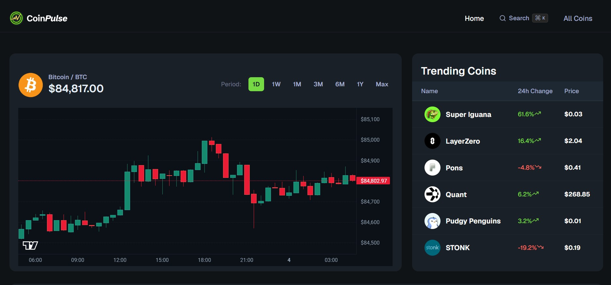

# CoinPulse 📈
A **crypto market dashboard** built with **Next.js 16**, **TypeScript**, **Tailwind CSS**, **Shadcn UI**, **Lightweight Charts**, and the **CoinGecko API**.

CoinPulse lets users track prices, explore candlestick charts, browse every coin with pagination, search instantly, and dive into detailed coin pages, all running on the **free CoinGecko Demo plan**.

Check it out here: [coinpulse](https://coinpulse-kappa-six.vercel.app/)

---

## 🚀 Features
- **Market Overview** – Bitcoin price, 24h change, and an interactive candlestick chart on the home page
- **Candlestick Charts** – switch between time periods (1D, 1W, 1M, and more) powered by Lightweight Charts
- **Trending Coins** – see what the market is talking about right now
- **Top Categories** – browse the biggest crypto categories at a glance
- **All Coins** – paginated market table with rank, price, 24h change, and market cap
- **Coin Details** – per-coin page with chart, market stats, links, about section, and top exchange listings
- **Coin Converter** – convert between a coin and USD in either direction
- **Quick Search** – command palette (`Ctrl/Cmd + K`) with debounced search and trending suggestions

---

## 🛠 Tech Stack
| Technology | Usage |
|------------|-------|
| Next.js 16 | App framework with App Router and Server Components |
| TypeScript | Strong typing & safety |
| CoinGecko API (Demo) | Market data, OHLC, search, and trending coins |
| Lightweight Charts | Candlestick charts |
| Shadcn UI + cmdk | Command palette and dialog components |
| SWR | Client-side data fetching for search |
| Tailwind CSS v4 | Styling & responsive design |
| Lucide React | Icons |

---

## ⚙️ Installation & Setup

1. **Clone the repo**
   ```bash
   git clone https://github.com/Shivanshu-Jha/coinpulse.git
   cd coinpulse
   ```

2. **Install dependencies**
   ```bash
   npm install
   ```

3. **Set up environment variables**

   Create a `.env.local` file in the project root:
   ```bash
   COINGECKO_BASE_URL=https://api.coingecko.com/api/v3
   COINGECKO_API_KEY=your_coingecko_demo_api_key
   ```

4. **Run the dev server**
   ```bash
   npm run dev
   ```

---

## 🔌 How the Data Works
- All requests go through a single server-side `fetcher` that attaches the API key header and caches responses for **60 seconds**
- Pages are server-rendered, so the API key is never exposed to the browser
- Chart period changes and search are the only client-triggered requests

### Demo plan limitations
| Limit | What it means for CoinPulse |
|-------|-----------------------------|
| No WebSockets | Prices are **not live**; they refresh on page load (cached up to 60s) |
| 365 days of history | The longest chart period is capped at 1 year |
| ~30 requests/minute | Heavy use can return a `429` error; wait a minute and retry |
| No custom `interval` on OHLC | Candle size is chosen automatically from the selected period |

Upgrading to a paid plan unlocks WebSockets and full history, and the app can be extended without changing its structure.

---

## 🗂 Project Structure
```text
app/
├── page.tsx              # Home: overview, trending, categories
├── coins/
│   ├── page.tsx          # Paginated coins table
│   └── [id]/page.tsx     # Coin details page
components/
├── CandleStickChart.tsx  # Interactive chart with period buttons
├── CoinConverter.tsx     # Coin <-> USD converter
├── SearchModal.tsx       # Command palette search
├── DataTable.tsx         # Generic reusable table
└── home/                 # Home page sections
lib/
├── coingecko.actions.ts  # Server-side API fetcher
└── utils.ts              # Formatting helpers
```


## 📸 Screenshots
### Home dashboard with candlestick chart



